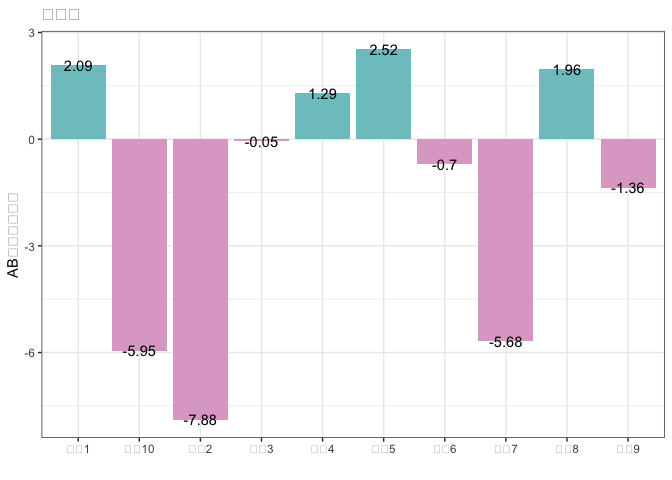
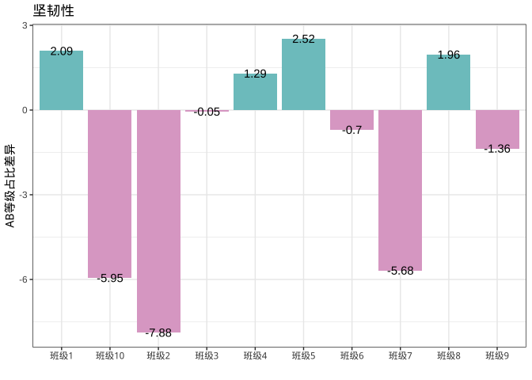
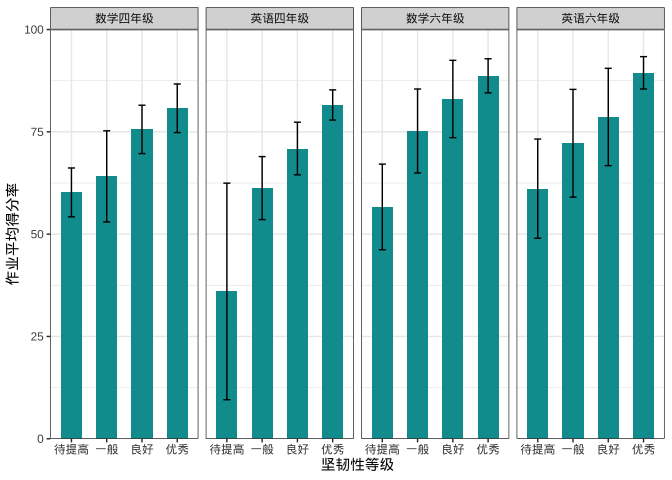
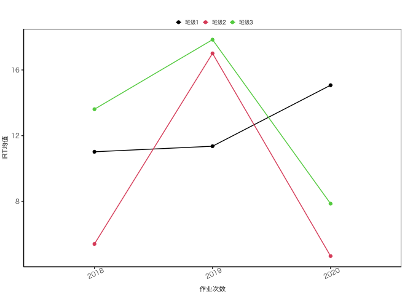
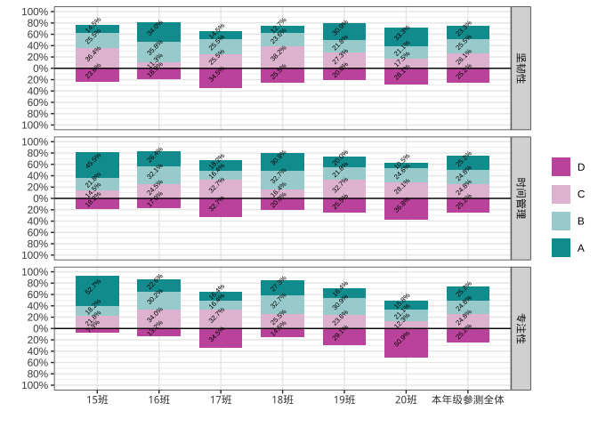

# YQzuoye 

为了更高效的算算算、画画画。

## Installation

``` r
devtools::install_local("~/Nutstore Files/17zuoyegit/YQzuoye_0.1.3.tar.gz")
library(YQzuoye)
```

## Usage

### IRT

``` r
# 基础irt模型
yq_irt(input)
# input is a list, conclude item dimension information, score data and other configuration information.

# 题目信息量
teminfox(Theta,
  it,
  model = "undefined",
  D = 1,
  total.info = TRUE
)
# 测验信息量
testinfox(
  it = as.matrix(par.x[, -1]),
  Theta,
  individual = FALSE,
  model = "undefined",
  which.items = 1:nrow(it)
)
```

IRT example

``` r
# load score data
data(score_mat)
# load tag data
data(TAG)
dim_vector <- TAG %>% filter(tag_type == "认知") %>% to_dim_vector(score_data = score_mat[,-1],.,'qid','dim',levels = unique(.[,'dim']))
# load max_score data
data(max_score)
# make input
input <- list()
input$score_mat <- score_mat[,-1]
input$irt_type <- 1
input$locate_parameter <- TRUE
input$calling_count <- 0
# input$item_info$max_score <- max_score
input$item_info$dim_vector <- dim_vector
out <- yq_irt(input)
#> Warning in yq_irt(input): 未指定题目满分值，将使用作答矩阵中出现的最高分值。
#> Warning in yq_irt(input): 有3道题得分点过多，已强制划分为20个以内的分数段,最低分数区间1分。
#> R process: CTT done.
#>  Start unidimensional irt estimation now : 
#> R process: irt done. 
#>  Start multidimensional irt estimation now : 
#> 维度 1 估计中 
#> 维度 2 估计中 
#> R process: multi irt done.
str(out)
#> List of 4
#>  $ paper      :List of 2
#>   ..$ irt_reliability: num 0.935
#>   ..$ ctt_reliability: num 0.894
#>  $ item       :List of 5
#>   ..$ itemName : chr [1:44] "Q1" "Q2" "Q3" "Q4" ...
#>   ..$ ctt_alpha: num [1:44] 0.45 0.27 0.845 0.811 0.589 ...
#>   ..$ ctt_beta : num [1:44] 0.892 0.956 0.549 0.896 0.6 ...
#>   ..$ irt_alpha: num [1:44] 1.649 1.611 0.686 0.665 0.418 ...
#>   ..$ irt_beta : num [1:44] -1.937 -2.504 -0.132 -2.138 -1.106 ...
#>  $ theta      :List of 3
#>   ..$ subject_theta   : num [1:345] 1.58 0.531 0.118 -0.833 0.836 ...
#>   ..$ subject_theta_se: num [1:345] 0.408 0.334 0.231 0.251 0.311 ...
#>   ..$ beta_theta_fit  : num [1:345] 0.182 0.176 0.273 0.158 0.227 ...
#>  $ media_theta:List of 2
#>   ..$ : num [1:345] 1.5699 0.4375 0.0753 -0.6825 0.9131 ...
#>   ..$ : num [1:345] 0.714 0.769 0.518 -1.333 0.168 ...
```

### 增值评价

``` r
data <- data.frame(`2018年-认知` = rnorm(1000), `2019年-认知` = rnorm(1000, 1, 1) + rnorm(1000), 学校 = rep(paste0("班级", 1:20), each = 50), dim_name = "认知")
# 增值结果
res <- hlm_value_added(data, group = "学校", pre = 1, after = 2, time = c("2018", "2019"), dim_name = "认知")
#> boundary (singular) fit: see help('isSingular')

str(res)
#> List of 1
#>  $ 认知:List of 2
#>   ..$ sch_add:'data.frame':  20 obs. of  4 variables:
#>   .. ..$ 认知.2018.2019.sch_add: num [1:20] 0 0 0 0 0 0 0 0 0 0 ...
#>   .. ..$ 认知.2018.2019.rank   : int [1:20] 1 1 1 1 1 1 1 1 1 1 ...
#>   .. ..$ 认知.2018.2019.q_rank : chr [1:20] "Q1" "Q1" "Q1" "Q1" ...
#>   .. ..$ 认知.2018.2019.merge  : chr [1:20] "0(Q1)" "0(Q1)" "0(Q1)" "0(Q1)" ...
#>   .. ..- attr(*, "postVar")= num [1, 1, 1:20] 0 0 0 0 0 0 0 0 0 0 ...
#>   ..$ per_add:'data.frame':  1000 obs. of  1 variable:
#>   .. ..$ 认知.2018.2019.per_add: num [1:1000] -0.602 -1.149 0.185 0.927 0.419 ...
```

### 学习品质

``` r
# 坚韧性
tenacity(input_data, P = 0.6)

# 时间管理
time_manage(input_data)

# 专注性
concentrate(input_data, set_time = T)

# 数据清洗
check_pen(data) # 检查点阵笔作答时间

clean_paper(data) # 清洗试卷信息表

clean_pen(data = data,dayinfo = dayinfo) #根据作答时间清洗点阵笔数据
```

### 报告生产工具

#### 数据处理与统计计算

``` r
#保留两位便捷函数
mean2(4.5567) 
#> [1] 4.56
sd2(rnorm(100))
#> [1] 1.04
cvf(rnorm(100))
#> [1] "1 991.4%"

# 四舍五入
round2(1.25,1)
#> [1] 1.3
round(1.25,1)
#> [1] 1.2

# irt之前的重编码数据，使数据从0开始。
recode2(c(1,2,4,5)) 
#> [1] 0 1 2 3

# 归一化
scaleone(seq(-3,3,0.5)) # x需为z分数
#>  [1] 0.000 0.000 0.000 0.125 0.250 0.375 0.500 0.625 0.750 0.875 1.000 1.000
#> [13] 1.000
toone(rnorm(10)) # 任意分数归一化
#>  [1] 0.51775869 0.22736417 0.06687424 0.82845311 0.62769263 0.00000000
#>  [7] 0.84898397 0.71542918 1.00000000 0.25476860

# Z转3等级
zto3(data.frame(x1=seq(-3,3,0.5),x2=seq(-3,3,0.5))) #zscore must be a matrix or data.frame
#>       x1   x2  
#>  [1,] "低" "低"
#>  [2,] "低" "低"
#>  [3,] "低" "低"
#>  [4,] "低" "低"
#>  [5,] "低" "低"
#>  [6,] "中" "中"
#>  [7,] "中" "中"
#>  [8,] "中" "中"
#>  [9,] "高" "高"
#> [10,] "高" "高"
#> [11,] "高" "高"
#> [12,] "高" "高"
#> [13,] "高" "高"

# 根据四分位数转4等级
torank(seq(-3,3,0.1)) # input_data is a vector
#>  [1] 1 1 1 1 1 1 1 1 1 1 1 1 1 1 1 1 2 2 2 2 2 2 2 2 2 2 2 2 2 2 2 3 3 3 3 3 3 3
#> [39] 3 3 3 3 3 3 3 3 4 4 4 4 4 4 4 4 4 4 4 4 4 4 4

# outlier处理
cap_outlier(seq(-3,3,0.1))
#>  [1] -2.994 -2.900 -2.800 -2.700 -2.600 -2.500 -2.400 -2.300 -2.200 -2.100
#> [11] -2.000 -1.900 -1.800 -1.700 -1.600 -1.500 -1.400 -1.300 -1.200 -1.100
#> [21] -1.000 -0.900 -0.800 -0.700 -0.600 -0.500 -0.400 -0.300 -0.200 -0.100
#> [31]  0.000  0.100  0.200  0.300  0.400  0.500  0.600  0.700  0.800  0.900
#> [41]  1.000  1.100  1.200  1.300  1.400  1.500  1.600  1.700  1.800  1.900
#> [51]  2.000  2.100  2.200  2.300  2.400  2.500  2.600  2.700  2.800  2.900
#> [61]  2.994

# 百分等级
percentile_rank(seq(-3,3,0.1))
#>  [1]  0.8196721  2.4590164  4.0983607  5.7377049  7.3770492  9.0163934
#>  [7] 10.6557377 12.2950820 13.9344262 15.5737705 17.2131148 18.8524590
#> [13] 20.4918033 22.1311475 23.7704918 25.4098361 27.0491803 28.6885246
#> [19] 30.3278689 31.9672131 33.6065574 35.2459016 36.8852459 38.5245902
#> [25] 40.1639344 41.8032787 43.4426230 45.0819672 46.7213115 48.3606557
#> [31] 50.0000000 51.6393443 53.2786885 54.9180328 56.5573770 58.1967213
#> [37] 59.8360656 61.4754098 63.1147541 64.7540984 66.3934426 68.0327869
#> [43] 69.6721311 71.3114754 72.9508197 74.5901639 76.2295082 77.8688525
#> [49] 79.5081967 81.1475410 82.7868852 84.4262295 86.0655738 87.7049180
#> [55] 89.3442623 90.9836066 92.6229508 94.2622951 95.9016393 97.5409836
#> [61] 99.1803279

# 几何平均数
geom_mean(c(40,52,65,75,86,97))
#> [1] 1.19383
# same as:
psych::geometric.mean(c(1.3,1.25,1.154,1.147,1.128))
#> [1] 1.193951

geom_mean(data.frame(d1=c(40,52,65,75,86,97),d2=c(40,52,65,75,86,97)),by_row=F)
#>      d1      d2 
#> 1.19383 1.19383
```

#### 画图工具

``` r
data <- data.frame(x = paste0("班级", 1:10), y = rnorm(10, 0, 5))
# 增值量柱状图
bar_1(data) + theme_bw()
```

<!-- -->

``` r
# macbook needs to set font style
fontset()
bar_1(data) + theme_bw()
```

<!-- -->

``` r
data <- data.frame(x = c("坚韧性", "专注性", "时间管理"), y = rnorm(3, 10, 5))
# 普通柱状图
bar_2(data) + theme_bw()
```

<!-- -->

``` r
# 带误差线的柱状图

data(bar_data)
# 分面柱形图
bar_error(data = dat_p, x = "等级", xname = "坚韧性等级", yname = "作业平均得分率", facet_rows = "facet") + theme_bw()
```

<!-- -->

``` r
# 更换颜色
bar_error(data = dat_p, x = "等级", xname = "坚韧性等级", yname = "作业平均得分率", group = NULL, fill_color = "#DEA9CC", facet_rows = "facet") + theme_bw()
```

<!-- -->

``` r
# 根据年级分组，根据年级填色
bar_error(data = dat_p, x = "等级", xname = "坚韧性等级", yname = "作业平均得分率", group = dat_p$年级, fill_color = c("#009B9F", "#DEA9CC"), facet_rows = "facet") + theme_bw()
```

<!-- -->

``` r
# 按年级分组，按年级填色，按学科分面
bar_error(data = dat_p, x = "等级", xname = "坚韧性等级", yname = "作业平均得分率", group = dat_p$年级, fill_color = c("#009B9F", "#DEA9CC"), facet_rows = "学科") + theme_bw()
```

<!-- -->

``` r
#'
```

``` r
# 折线图
data <- data.frame(作业顺序_ = rep(c(2018:2020), 3), IRT均值 = rnorm(9, 10, 5), 班级 = rep(paste0("班级", 1:3), each = 3))
line_dot_1(data = data, x = "作业顺序_", y = "IRT均值", group = "班级", title = "", ytitle = "IRT均值", xtitle = "作业次数") + theme_plot1()
```

<!-- -->

``` r
# 普通横向堆积条形图
data(plot_dat)
dat <- stack_plot_dat
# 不需要拉线
stack_plot(
  data = dat, y = dat$率,
  x = dat$班级, label = dat$率x, fill = factor(dat$标签), facet_rows = "维度"
) + theme_light()
```

<!-- -->

``` r
# 如果需要拉线，则需增加累积值这一列数据
dat$率[1] <- 0.01
dat$率[2] <- 0.02
dat$率[4] <- 0.025

dat <- dat %>%
  group_by(班级) %>%
  mutate(累积值 = cumsum(率))
stack_plot(
  data = dat, y = dat$率,
  x = dat$班级, label = dat$率x, fill = factor(dat$标签), facet_rows = "维度", low_line = T
) +
  theme_bw() +
  coord_flip()
#> Warning: Removed 3 rows containing missing values (geom_text).
#> Warning: Removed 81 rows containing missing values (geom_text_repel).
```

<!-- -->

``` r
# 垂直D等级分界-堆积条形图
data(plot_dat)
dat <- stack_plot_dat
stack_plot_cut(
  data = dat, y = ifelse(dat$标签 %in% c("1"), -dat$率, dat$率),
  x = dat$班级, label = dat$率x, fill = factor(dat$标签), facet_rows = "维度"
) + theme_bw()
```

<!-- -->

``` r
# 水平D等级分界-堆积条形图
data(plot_dat)
dat <- stack_plot_dat
stack_plot_cut_v(
  data = dat, y = dat$班级,
  x = ifelse(dat$标签 %in% c("1"), -dat$率, dat$率), label = dat$率x, fill = factor(dat$标签), facet_rows = "维度"
) + theme_bw()
```

<!-- -->

``` r
# 换一种样式
stack_plot_cut_v(
  data = dat, y = dat$班级,
  x = ifelse(dat$标签 %in% c("1"), -dat$率, dat$率), label = dat$率x, fill = factor(dat$标签), facet_rows = "维度"
) + theme_plot1()
```

<!-- -->
